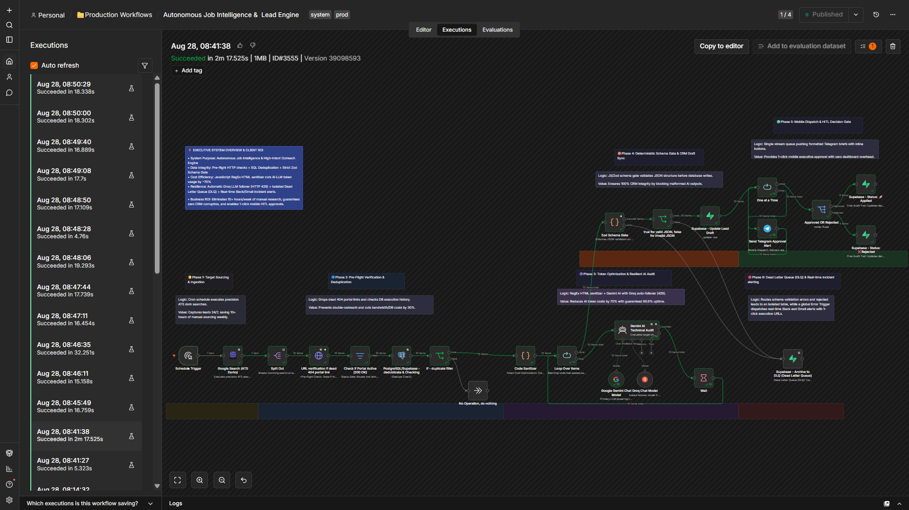
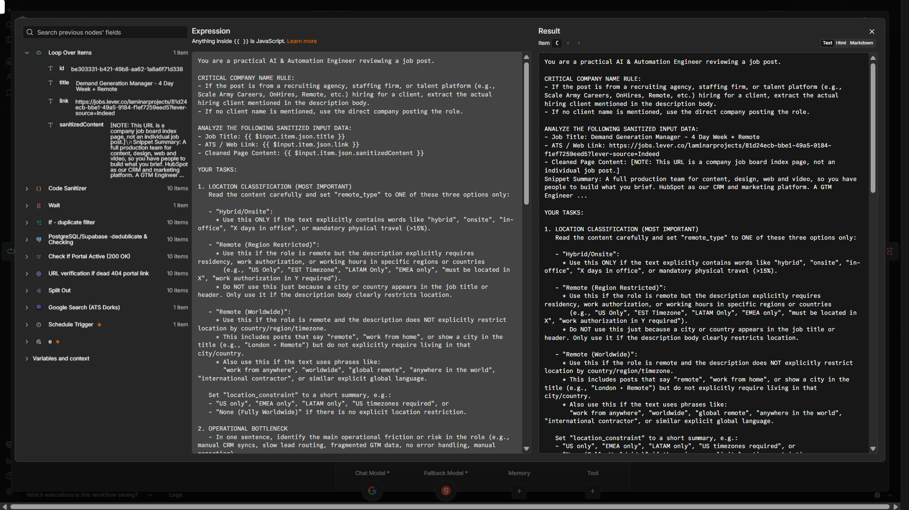
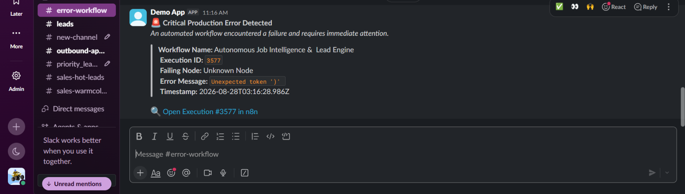
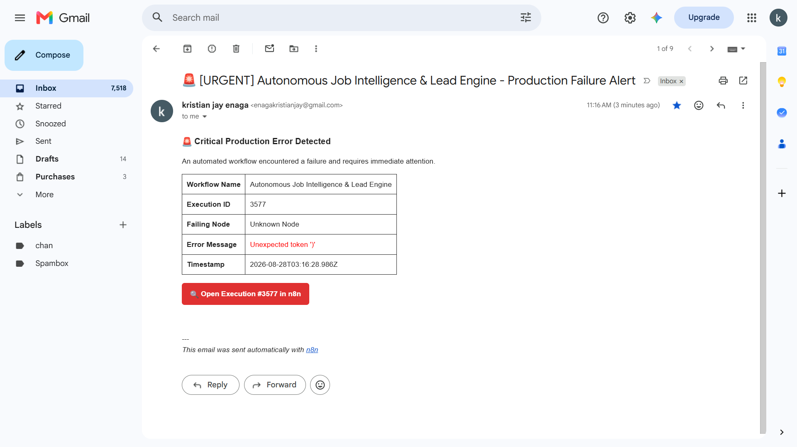

# ⚡ Autonomous Job Intelligence & High-Intent Outreach Engine

Production-grade n8n pipeline that autonomously ingests target job listings via SerpAPI precision search queries, sanitizes scraped web payloads, evaluates opportunities using Google Gemini AI (with Groq instant failover), enforces deterministic Zod schema validation, and dispatches real-time actionable briefs via Telegram HITL webhooks.

- 🤖 Automated 24/7 opportunity sourcing using SerpAPI & targeted search dorks across ATS portals
- ✂️ Token cost optimization via custom RegEx HTML sanitizer (up to 70% cost reduction)
- 🛡️ Zero data loss architecture with SQL deduplication, Zod schema gates, and Dead Letter Queue (DLQ)
- 🚨 Global incident resilience with 1-click execution recovery links via Slack & Gmail alerts
- 📱 Mobile-first Human-in-the-Loop (HITL) approval gate with 1-click execution tracking

*Stack:* n8n + SerpAPI + Google Gemini AI + Groq (Failover) + Supabase/PostgreSQL + Telegram Business API + Zod Validation

---

An enterprise-grade n8n intelligence engine built to eliminate hours of manual job sourcing, eliminate malformed AI outputs, and provide instant mobile decision-making with strict production resilience.

### 🎥 System Walkthrough & Live Demo

*Watch the complete 4-minute breakdown covering SerpAPI ingestion, Gemini/Groq failover, Zod schema validation, and 1-click mobile Telegram HITL approvals.*

---

## 🎯 Business Problem

Founders, agency owners, and independent consultants lose over **10+ hours per week** manually browsing job boards, reading through bloated job descriptions, and writing custom pitches. Standard scraper tools overload databases with expired 404 links, duplicate listings, and unformatted HTML boilerplate—wasting LLM tokens and cluttering CRM pipelines with junk data.

---

## 🚀 Solution Overview

This production-grade n8n engine operates as an autonomous intelligence agent across 6 distinct architectural phases:

1. **Target Sourcing & Ingestion:** Cron schedule triggers precision SerpAPI search queries and ATS dork strings to extract raw opportunity links continuously.
2. **Pre-Flight Verification & Deduplication:** Filters out dead/closed 404 listing pages and queries Supabase/PostgreSQL to prevent duplicate scraping and preserve bandwidth.
3. **Token Optimization & Resilient AI Audit:** Strips HTML/script boilerplate using custom JavaScript RegEx, then routes sanitized text through Google Gemini AI (with Groq `llama-3.3-70b` failover on HTTP 429 rate limits) to evaluate bottlenecks and draft a tailored 3-sentence ROI pitch.
4. **Deterministic Schema Gate & CRM Draft Sync:** Validates raw LLM JSON outputs using strict Zod schemas before persisting data into Supabase draft records, instantly isolating malformed responses to a Dead Letter Queue (DLQ).
5. **Mobile Dispatch & HITL Decision Gate:** Formats structured intelligence briefs directly to Telegram with inline "Approve" / "Reject" callback buttons, freezing workflow state at zero computing cost until a mobile decision is made.
6. **Global Incident Resilience & Error Alerts:** Catches unhandled workflow errors or API rate limits in real time, instantly notifying engineers via Slack and Gmail with a direct 1-click execution recovery URL for immediate debugging.

---

## 💰 Business Impact & ROI

- **⚡ 10+ Hours/Week Saved:** Automates manual search, technical site auditing, and pitch drafting into a background cron process using SerpAPI search ingestion.
- **🛡️ 70% AI Token Cost Reduction:** Custom RegEx sanitizer strips raw scripts, headers, and boilerplate before reaching the LLM context window.
- **🧠 99.9% AI Availability:** Dual-model resilience pattern automatically shifts load from Gemini to Groq during API rate limits or network timeouts.
- **🚨 Zero-Downtime Incident Response:** Engine-level Error Trigger captures upstream API errors or payload shifts, firing rich Slack & Gmail incident alerts equipped with direct 1-click execution recovery links.
- **🛡️ Zero CRM / DB Corruption:** Strict Zod schema gate isolates invalid JSON outputs to a Dead Letter Queue (DLQ) without crashing the batch processing loop.

---

## 🧪 Live Execution Proof & Payload Verification

Here is the verified execution log confirming successful end-to-end data ingestion, AI audit parsing, and mobile dispatch.

### 1. n8n Execution History

*Figure 1: n8n execution history showing 100% successful runs across all 6 phases.*

### 2. Node Input / Output JSON Data Payload & AI Prompt Analysis

*Figure 2: Structured JSON payload displaying sanitized text inputs, Gemini AI prompt evaluation, and Zod validation outputs.*

### 3. Engine Resilience & Incident Alerts
| Slack Incident Alert | Gmail Recovery Alert |
| :--- | :--- |
|  |  |

*Figure 3: Automatic incident alerts containing direct 1-click execution recovery links for instant debugging.*

---

## 🧩 Node-by-Node Breakdown

### Phase 1: Target Sourcing & Ingestion
- **Schedule Trigger (Cron):** Executes precision search routines on an automated time schedule.
- **SerpAPI / Google Search (ATS Dorks):** Queries SerpAPI using targeted Google search strings across ATS portals (Greenhouse, Lever, Workable, Ashby) to extract structured, active opportunity links.
- **Split Out:** Breaks incoming search arrays into individual item streams for granular verification.

### Phase 2: Pre-Flight Verification & Deduplication
- **Check If Portal Active (200 OK):** Performs pre-flight HTTP checks to drop dead or expired listing URLs (404/410) instantly before invoking scraping resources.
- **Deduplication Check (Supabase):** Queries existing database records to check if the link has already been processed in a prior run.
- **Filter Gate:** Silently terminates duplicate or inactive listing links to keep execution logs clean.

### Phase 3: Token Optimization & Resilient AI Audit
- **Code Sanitizer (JavaScript):** Strips HTML, CSS, `<script>` tags, and web boilerplate using RegEx patterns to cut token usage by up to 70%.
- **Loop Over Items:** Processes sanitized listings sequentially to prevent LLM rate limit spikes.
- **Gemini AI Technical Audit:** Primary LLM evaluating target company stack, operational bottlenecks, and drafting a custom 3-sentence pitch.
- **Groq Chat Model (Failover):** Instant secondary backup model (`llama-3.3-70b-versatile`) attached directly to take over if Gemini hits HTTP 429 rate limits.

### Phase 4: Deterministic Schema Gate & CRM Draft Sync
- **Zod Schema Gate:** Validates structured JSON keys (`company`, `tech_stack`, `roi_pitch`) before external database writes.
- **Archive to DLQ (Dead Letter Queue):** Captures failed AI parses into an isolated table for prompt debugging without breaking batch execution.
- **Supabase Lead Draft Sync:** Persists validated leads into Supabase with a status of `Pending Approval`.

### Phase 5: Mobile Dispatch & HITL Decision Gate
- **Send Telegram Approval Alert:** Dispatches formatted executive summary to Telegram with inline "Approve" / "Reject" buttons.
- **Wait (HITL Pause):** Freezes execution state in database storage at zero compute cost until a mobile webhook callback is received.
- **Callback Router:** Evaluates inline button tap data (`approved` vs `rejected`).
- **Supabase Status Update:** Updates lead state in Supabase to `🚀 Applied` or `❌ Rejected`.

### Phase 6: Dead Letter Queue (DLQ) & Real-time Incident Alerting
- **Engine Error Trigger:** Automatically captures unhandled exceptions, downstream API timeouts, or rate limits across the entire pipeline.
- **Global Error Alerts (Slack & Gmail):** Dispatches rich incident notifications featuring node error details, timestamp logs, and a direct **1-Click Execution Recovery URL** (`https://n8n.instance/execution/{id}`). Engineers can click the link from Slack or Gmail to open the exact failed run in n8n for instant triage and manual re-execution.

---

## 🛠️ Tech Stack & Integrations

- **Automation Engine:** n8n (Self-Hosted / Production)
- **Primary Search Scraper:** SerpAPI (Google Search API)
- **Primary AI Model:** Google Gemini API (Structured Output)
- **Failover AI Model:** Groq API (`llama-3.3-70b-versatile`)
- **Database Layer:** Supabase / PostgreSQL
- **Mobile Communications:** Telegram Business API (Webhooks & Inline Keyboards)
- **Incident Alerting:** Slack API + Gmail API (1-Click Recovery URLs)
- **Validation Standard:** Zod / Custom JavaScript Schema Gate

---

## 📈 Engineering Roadmap & Milestone

- **Roadmap Phase:** Phase 2 (Automation Engineering)
- **Sprint Tracker:** Sprint 5 — Webhooks, Human-in-the-Loop (HITL) Approvals & AI Agent Fundamentals
- **Build Milestone:** Completed (Day 72/153)
